# IFR Simulink to PX4 Code Generation (V3:beta:1.0 for PX4 v1.13.2) <!-- omit in toc -->

>**WARNING:**
>**As this README is written, the "IFR-CodeGen V3" is still in the Beta Phase. Functionalities may be changed, removed or added in the final version.**

By using the "IFR Simulink to PX4 Code Generation" (short name "IFR-CodeGen") the content resp. functionalities of a given Simulink Model can automatically be transferred into a module of the PX4 Autopilot, a firmware running on the Pixhawk flight controller[^1] family. This is achieved by generating C-/C++ Code from the Simulink Model and wrapping it into the required format of a PX4 module. The IFR-CodeGen originates from the [Institute of Flight Mechanics and Controls (IFR)][1] of the University of Stuttgart and has been used in various developments of novel GNC (Guidance Navigation Control) algorithms.

The document is intended to be more than a typical README and rather be a complete Guide on how to install and use the IFR-CodeGen. It covers the whole process how to get the content of a simulink model into a PX4 module, running on a pixhawk flight controller. All steps how to modify, compile and finally flash the PX4 Firmware onto the pixhawk are explained. This goes beyond the core functionality of the IFR-CodeGen, which are implemented as MATLAB scripts or functions. 

Currently the Guide does not contain a section about future or planned developments of the IFR-CodeGen. A roadmap for this project does not exist. However the `TODO.txt` text file can be found in the project folder. It contains an overview of all currently known problems and possible points for improvements.

The "IFR-CodeGen" or more exactly the "IFR-CodeGen V3" of this repository is intended to be used with the PX4 Version 1.13.2. It was developed and tested to work with PX4 v1.13.2. It may work with earlier releases of v.1.13 (e.g. v.1.13.0) but previous versions (e.g. v1.12.3) do not work. Earlier variants than the "V3" of the IFR-CodeGen do exist and they work with previous versions of the PX4 Firmware. The development of the IFR-CodeGen started in 2018. Currently this repository only contains the the "V3" variant with one exemption[^2].

[^1]: The Pixhawk family flight controllers are typically used on UAVs (e.g. copters, fixed-wings) but are also run on various other types of vehicles like unmanned ground vehicles (UGVs) or even unmanned undersea vehicles (UUV).

[^2]: As of Feb 23, 2023 the branch `v.12.3` is available in this repository. This version of the IFR-CodeGen works with PX4 Firmware v1.12.3. However, the usage differs significantly from the steps described in this guide.

### Table of Content: <!-- omit in toc -->

- [1. Installation](#1-installation)
  - [1.1. Prerequisites](#11-prerequisites)
  - [1.2. PX4 Developer Environment (Toolchain)](#12-px4-developer-environment-toolchain)
  - [1.3. IFR CodeGen Integration](#13-ifr-codegen-integration)
    - [1.3.1. Map Ubuntu as a Network Drive](#131-map-ubuntu-as-a-network-drive)
    - [1.3.2. Necessity for a Working Folder on C:/](#132-necessity-for-a-working-folder-on-c)
  - [1.4. Simulink Models Location](#14-simulink-models-location)
  - [1.5. Recommended Additional Software](#15-recommended-additional-software)
    - [1.5.1. Visual Studio Code](#151-visual-studio-code)
    - [1.5.2. QGroundControl](#152-qgroundcontrol)
  - [1.6. Integration in forked repository of custom IFR PX4 Firmware v1.13.2 (PX4-IFR V3)](#16-integration-in-forked-repository-of-custom-ifr-px4-firmware-v1132-px4-ifr-v3)
  - [1.7. Integration in a standalone custom IFR PX4 Firmware v1.13.2 (PX4-IFR V3)](#17-integration-in-a-standalone-custom-ifr-px4-firmware-v1132-px4-ifr-v3)
- [2. Usage](#2-usage)
  - [2.1. Quick Overview](#21-quick-overview)
  - [2.2. Adding Simulink Models](#22-adding-simulink-models)
  - [2.3. Working with the Model](#23-working-with-the-model)
    - [2.3.1. Parameters](#231-parameters)
    - [2.3.2. Constants](#232-constants)
    - [2.3.3. Clock](#233-clock)
    - [2.3.4. Subscribe to Topics](#234-subscribe-to-topics)
    - [2.3.5. Publish Topics](#235-publish-topics)
    - [2.3.6. Create own Topics (uORBs)](#236-create-own-topics-uorbs)
    - [2.3.7. Check Model](#237-check-model)
  - [2.4. Creating the Module](#24-creating-the-module)
  - [2.5. Activating the Module](#25-activating-the-module)
    - [2.5.1. Adding a Module to a Board](#251-adding-a-module-to-a-board)
    - [2.5.2. Automatically Start a Module](#252-automatically-start-a-module)
  - [2.6. Generating the Code](#26-generating-the-code)
  - [2.7. Building the Firmware](#27-building-the-firmware)
  - [2.8. Flashing the Firmware](#28-flashing-the-firmware)
  - [2.9. Deactivating a Module](#29-deactivating-a-module)
    - [2.9.1. Removing a Module from a Board](#291-removing-a-module-from-a-board)
    - [2.9.2. Removing a Module from the Auto-Start](#292-removing-a-module-from-the-auto-start)
  - [2.10. Delete a Module](#210-delete-a-module)
  - [2.11. Additional Points](#211-additional-points)
    - [2.11.1. Priority and Scheduling within PX4 Firmware](#2111-priority-and-scheduling-within-px4-firmware)
    - [2.11.2. Coding Style](#2112-coding-style)
    - [2.11.3. Free up Stacksize](#2113-free-up-stacksize)
    - [2.11.4. Relevant Changes to previous Versions of IFR-CodeGen](#2114-relevant-changes-to-previous-versions-of-ifr-codegen)
    - [2.11.5. Customizing Logger Topics](#2115-customizing-logger-topics)
  - [2.12. Custom Changes in the Codegen](#212-custom-changes-in-the-codegen)
    - [2.12.1. Bug fix for `bus_i`](#2121-bug-fix-for-bus_i)
    - [2.12.2. Removal of `replaceCodeGenFilesV3`](#2122-removal-of-replacecodegenfilesv3)
- [3. Trouble-Shooting](#3-trouble-shooting)
    - [3.1. Working with a Simulink model](#31-working-with-a-simulink-model)
  - [3.2. Generate the Code](#32-generate-the-code)
  - [3.3. Building the Firmware](#33-building-the-firmware)
    - [3.4. Using the Firmware](#34-using-the-firmware)


## 1. Installation

This section covers all necessary steps to set up a development environment with integrated "IFR-CodeGen" to compile PX4 Firmware with own modules derived from Simulink models. The first parts from [1.1.](#11-prerequisites-) to [1.5.](#15-recommended-additional-software-) are independent from the source of the PX4 Firmware, so the "IFR-CodeGen" can also be integrated in existing projects. The last two parts of this section [1.6.](#16-integration-in-forked-repository-of-px4-ifr-version-v1132-) and [1.7](#17-integration-in-standalone-px4-ifr-version-v1132-) are dealing with two cases, in which an IFR-internal versions of the PX4 Firmware are used.

### 1.1. Prerequisites

The following hard- and software is required to use the "IFR-CodeGen":

- Hardware:
  - Laptop or desktop computer with up-to-date RAM and CPU specifications
  - Pixhawk flight controller
- Software:
  - Windows 10 Operating System (Windows 11 should also work, but has not been tested at IFR)
  - MATLAB with Simulink 
    - Toolboxes: 
      - Matlab Coder
      - Simulink Coder
      - Embedded Coder
    - Version/Release:
      - Tested: 2020b, 2022a
      - Untested: the IFR-CodeGen is not strongly dependent on a specific release. All releases after 2020b should work. Releases before 2020b may work. However, the simulink model templates (see [1.4.](#14-adding-simulink-models-)) are 2020b models. They cannot be used with earlier MATLAB versions without a prior conversion. But they are not essential if own models are used.

It should also be possible to use MATLAB/Simulink installed on a supported Linux Distribution (e.g. Ubuntu). However, this has not been tested at the IFR.

### 1.2. PX4 Developer Environment (Toolchain)

The current recommended way to set up an PX4 development environment to compile PX4 Firmware on Windows 10 (or Windows 11) is to use the builtin [Windows Subsystem for Linux][4] ([WSL2][5]). The WSL is like an integrated virtual machine with an linux operating system. It is deeply integrated into windows, which offers several advantages like a very good performance. The WSL comes with Windows 11 and Windows 10 (with current update installed) and is free of charge.

The WSL allows the user to install and run the recommended [PX4 Linux development environment][6] on a windows machine. It is also possible and even recommended to install the PX4 development environment directly on a Linux computer with Ubuntu OS. However, this guide will focus on the windows alternative. 

Previously, an dedicated [PX4-windows-toolchain][2] existed, which created an *Cygwin* based environment with all necessary tools. It als came with an simple and easy to use installer. As this toolchain is not supported anymore, it does not work with current releases of the PX4 Firmware. It is deprecated and WSL must be used instead with current builds.

The following list shows only the major steps to install the WSL and PX4 development environment. For more detail see the corresponding page on the [PX4 User Guide][3]:

1. Install WSL2:
    1. Open a command prompt by running the *cmd.exe* as an administrator.
         - Press the Windows **Start** key.
         - type in `cmd`
         - select "run as administrator"
    2. Run the installation command `wsl --install`. 
    The current recommend Ubuntu version by PX4 is 20.04. By default current windows versions installs Ubuntu 22.04. It has been verified that compiling the PX4 Firmware with integrated IFR-CodeGen also works with the Ubuntu 22.04 version. No experience has been gathered using any of the simulation tools, which also come with the PX4 toolchain. They may need Ubuntu 20.04. For more details see the corresponding page on the [PX4 User Guide][6]. During the installation of WSL the Ubuntu version can be forced to be the 20.04 by running the command `wsl --install -d Ubuntu-20.04`. A list of all possible linux distributions to be installed within the WSL can be produced by running `wsl --list --online`.
    3. Reboot the computer. Wait (a couple of minutes) for the installation to be finished after restarting and logging in to windows. You will be asked to choose a user name and password for the previously selected Ubuntu distribution. They can be freely chosen. If the installation does not automatically finish, try opening a WSL shell as described in the next step.
    4. Open a WSL shell by opening a command prompt (*cmd.exe*) and simply type in `wsl`. Within the WSL shell you are basically using the terminal or console of the installed Linux distribution.
    5. To update Ubuntu just run the following commands `sudo apt update`, `sudo apt dist-upgrade`, `sudo apt autoremove`.
 2. Get a folder containing the PX4 Firmware v1.13.2 source files into the WSL file system. For the further pages of this guide, it is assumed the folder is named "PX4_IFR_V3" and placed in the home folder `~/PX4_IFR_V3`. The sections  [1.6.](#16-integration-in-forked-repository-of-px4-ifr-version-v1132-) and [1.7](#17-integration-in-standalone-px4-ifr-version-v1132-) show two possibilities for this step, when working with the custom "IFR PX4 Firmware Version v1.13.2". But it is also possible to clone directly from the official PX4 Repo `git clone --recursive --branch 'v1.13.2' https://github.com/PX4/PX4-Autopilot.git`.
 3. Install PX4 Toolchain
    - navigate to the folder containing the PX4 Firmware source files (e.g. `cd ~/PX4_IFR_V3`). 
    - Execute the command `bash ./Tools/setup/ubuntu.sh --no-sim-tools`. The option `--no-sim-tools` will install the toolchain without any simulation tools, which is sufficient for building the PX4 Firmware. If simulation tools will be required, the option must be removed.
    - Reboot the WSL.
4. Verify PX4 toolchain is working by trying to build the PX4 Firmware without any modifications. For example run `make cubepilot_cubeorange`. After completion it should show a similar output to the picture below. Alternatively the successful build can be verified by the existence of the binary `~/PX4_IFR_V3/build/cubepilot_cubeorange_default/cubepilot_cubeorange_default.px4`.

    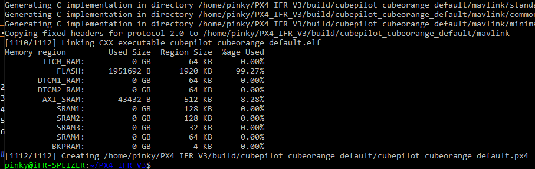


### 1.3. IFR CodeGen Integration

The folder containing all the source files for the IFR-CodeGen must placed within the `Tools` folder of the PX4 Firmware and should be named `ifr_codegen`. See picture below.

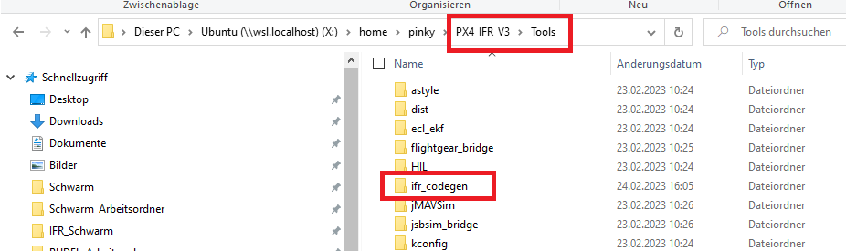

If the folder is missing, it can also be included as a submodule. This requires that the user has access to the [IFR github][7].

    git submodule add https://github.tik.uni-stuttgart.de/iFR/IFR_CodeGen_PX4_V3.git Tools/ifr_codegen

The above git command must executed from the root folder of the PX4 Firmware repository. This has the advantage that all improvements of the IFR-CodeGen can be pulled directly from the repository.

When using a custom PX4 Firmware provided by the IFR, the `ifr_codegen` is already present in the `tools` folder.

#### 1.3.1. Map Ubuntu as a Network Drive

To allow MATLAB to access the files within the WSL the Ubuntu Distribution should be mapped as a network drive. In order to do this the *Linux/Ubuntu* folder must be right-clicked within the Windows Explorer and the option *Map network drive...* must be selected. The picture below should help finding the correct location. The actual drive can be freely selected. For the rest of this guide it is assumed that it is mapped to `X:`.

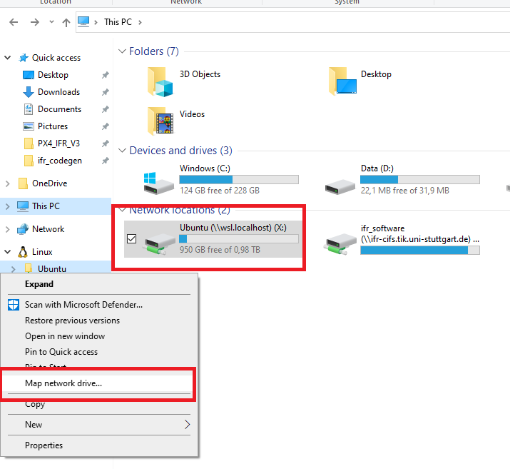

#### 1.3.2. Necessity for a Working Folder on C:/

Currently the IFR-CodeGen requires a working folder outside the WSL to work efficiently. For that purpose the folder 

    C:/PX4_Firmware_IFR_CodeGen/

is automatically created when using the IFR-CodeGen. It is important that the drive `C:` exists and the user has enough privileges.

### 1.4. Simulink Models Location

Currently the IFR-CodeGen expects all simulink models, which are designated to be converted into PX4 modules, to be located in a specific folder within the PX4 source code.

    ~/PX4_IFR_V3/Tools/simulink_controllers/

Momentarily the name of the folder `simulink_controllers` cannot be changed. If it does not exist, it must created under `Tools/`.

It may be advisable to make the folder a git submodule of the main PX4 repository. For details regarding this approach see section [Adding Simulink Models](#24-adding-simulink-models-).

### 1.5. Recommended Additional Software

#### 1.5.1. Visual Studio Code

*Visual Studio Code* or short *VS Code* is a free source-code editor from Microsoft. It has the advantage to be very well integrated in WSL. This makes it the premier choice when writing own application directly in C/C++ for the PX4 Firmware. All changes to the PX4 source code can be conveniently performed with *VS Code*. Additionally, it offers the possibility to directly compile the code without the necessity to switch to an external console to enter the build command.

Installation Steps:
  1. [Download][8] and Install VS Code in Windows
  2. Open VS Code
  3. Install the Remote-WSL Extension
  4. Install the C/C++ Extension pack
  5. Close VS Code

Usage: 
  1. Open a WSL Shell
  2. Navigate to the PX4 Firmware main folder (e.g. `~/PX4_IFR_V3`)
  3. Start VS Code by entering `code .` (Note the point!)

The IFR-CodeGen does not rely on using *VS Code* when converting Simulink models into PX4 modules. Still, *VS Code* is a very good possibility to work with the other parts of the PX4 source code when the need arises.

#### 1.5.2. QGroundControl

[QGroundControl][9] (QGC) is a ground control station for drones using the MAVLINK communication protocol for outside communications. This applies to all drones using PX4 powered autopilots.

Besides the possibility to monitor and control drones (and potentially other vehicles) during operation, it offers the functionality to flash new firmware onto the autopilot. Although there are other possibilities, flashing the PX4 firmware with QGC onto the flight control board is a very easy and user friendly way. For this reason using QGC is highly recommended and the only option described in this guide in the [Flashing Firmware](#28-flashing-firmware) section.

### 1.6. Integration in forked repository of custom IFR PX4 Firmware v1.13.2 (PX4-IFR V3)

The [PX4_IFR_V3][11] git repository is forked from the `stable` branch of the original [PX4][10] repository. It resembles the stable release `v.1.13.2` from Nov 22, 2022. 

Currently the PX4_IFR_V3 repo is only hosted on the **IFR-github** and not on the **IFR-gitlab**. To access and clone the repository the user must have access rights to the **IFR-github**. 

Momentarily the `master` of PX4_IFR_V3 does not contain the IFR-CodeGen. Because of the ongoing Beta-phase the user must switch to the `codege_develop` branch, which includes the IFR-CodeGen repository as a submodule. 

To get the PX4_IFR_V3 content into the WSL the user can simply execute the following command in his home folder.

    git clone --recursive --branch codege_develop https://github.tik.uni-stuttgart.de/iFR/PX4_IFR_V3

### 1.7. Integration in a standalone custom IFR PX4 Firmware v1.13.2 (PX4-IFR V3)

When working with partners the PX4_IFR_V3 repository may be exchanged as a standalone Zip-File (`PX4_IFR_V3.zip`). This version contains the IFR-CodeGen folder already placed in `~/PX4_IFR_V3/Tools/ifr_codegen`). The content is identical to the IFR-Codegen repository but any `git` related content is removed, so it is not a git repository anymore.

It is important to follow this sequence when trying to get PX4_IFR_V3 into the home directory of the WSL:

  1. Copy the Zip-File `PX4_IFR_V3.zip` into the user's home directory of the WSL
  2. Unzip the file with `unzip PX4_IFR_V3.zip` (if unzip fails the necessary package can be installed with `sudo apt install unzip`).

Do NOT unzip the folder in Windows and move the content to WSL. This messes up user rights to the folder. 

## 2. Usage

Before following the next steps in this section of this guide make sure you followed all steps of the previous section. It is assumed that the user has set up a fully functioning PX4 toolchain in WSL and a locally installed copy of MATLAB/Simulink with all required toolboxes. It is also assumed that

  1. The Version of the PX4 Firmware is v.1.13.2.
  2. The IFR-CodeGen folder is located in `/PX4_IFR_V3/Tools/ifr_codegen`.
  3. Permission to create working folder `C:/PX4_Firmware_IFR_CodeGen/` is granted.

This Guide covers all the necessary steps from adding and modifying the simulink models to flashing the modified PX4 Firmware onto the Pixhawk flight controller board. Additional help and insight for the steps, which are not IFR-CodeGen dependent (e.g. working with uORB messages or the flashing itself), can also be found in the [PX4 User Guide][17].

All the required matlab scripts containing the necessary functions for the IFR-CodeGen are located in the `ifr_codegen` folder. The user must only interact with the functions resp. scripts, which are located in the top-level of the `ifr_codegen` folder.

>**Important:**
>**Open the IFR-CodeGen MATLAB-scripts via the network drive and NOT via the "Linux/Ubuntu path in the explorer.**

### 2.1. Quick Overview

Before explaining all the steps of building a custom PX4 Firmware with the IFR-CodeGen in detail, this section will give an short overview of the necessary sequence to generate a module from an existing Simulink model.

  1. Place the Simulink model in the `PX4_IFR_V3/Tools/simulink_controllers/` folder.
  2. Open and modify the Simulink model with the `openModel()` function. This includes using uORB/topic busses for the in- and outports of the model.
  3. Create the module with the `createModule()` function.
  4. Activate the module with the `activateModule()` function. Can also be done after the next step.
  5. Generate the actual code by running the `generateModule.m` MATLAB script.
  6. Build and flash the custom PX4 Firmware.

 > General hint: all interactions happen in the MATLAB command window. 

Deactivating the module is achieved with the `deactivateModule()` function and complete removal with the `deleteModule()` function.

### 2.2. Adding Simulink Models

Currently the IFR-CodeGen expects all simulink models, which are designated to be converted into PX4 modules, to be located in a specific folder within the PX4 source code.

    ~/PX4_IFR_V3/Tools/simulink_controllers/

It is also necessary to strictly follow some naming conventions and rules when placing own simulink models within the `simulink_controllers` folder:

  1. Each simulink model must be placed within a subfolder with an identical name (e.g. `~/PX4_IFR_V3/Tools/simulink_controllers/example_simulink_model/example_simulink_model.slx`).
  2. If the simulink model is also used for other purposes (e.g. within an simulation), it may be necessary to use an wrapper model to keep the in- and outports of the original model. In this case an additional simulink model acting as such an wrapper must be placed within the same folder and named accordingly with an "_wrapper_firmware" extension to the original model name (e.g. `~/PX4_IFR_V3/Tools/simulink_controllers/example_simulink_model/example_simulink_model_wrapper_firmware.slx`). The wrapper model contains the original model as a "reference model" and handles the interface necessary for the PX4 Firmware integration.
      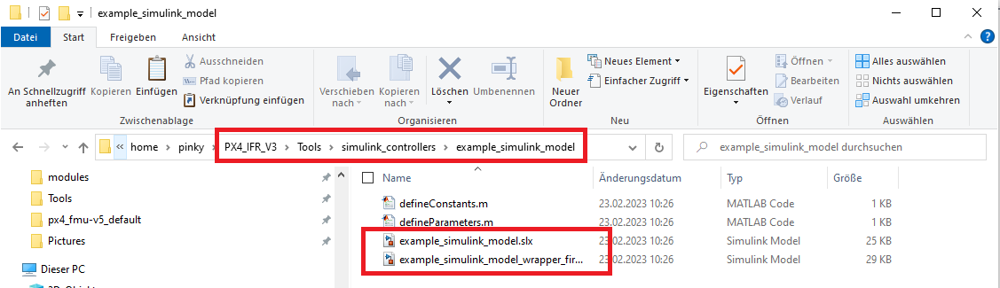
  3. All models placed in the subfolders `~/PX4_IFR_V3/Tools/simulink_controllers/Archive` and `~/PX4_IFR_V3/Tools/simulink_controllers/Future_Work` are neglected by the IFR-CodeGen. The existence and usage of these folders is optional.

Two examples (with or without an wrapper model) are available as templates within the IFR-CodeGen directory (see `example_simulink_model` and `example_simulink_model_single` in `~/PX4_IFR_V3/Tools/simulink_controllers/templates`. They are core examples which contain all the necessary content. They are also a good starting point when building up an simulink model from scratch, which is intended to be converted into a PX4 module. 

Having a separate folder to store all simulink models offers the possibility to integrate them as a git submodule into the PX4 Firmware main repository. This is especially beneficial, if the model's actual development is carried out with other simulations. The folder with the simulink models could be a git submodule for both the "Simulation" repository and the PX4 Firmware repository. Then, any changes made in either repository can easily be "pulled" from the other repository. However, this approach requires an additional "firmware wrapper" for every simulink model.

Adding or removing simulink models can be done at any time. Though it is unadvisable to remove a model with an existing corresponding PX4 module as it would not be possible to regenerate the necessary source files if the need arises.

### 2.3. Working with the Model

Every Simulink must have a certain structure and some core content to be able to converted into a PX4 module. 

  1. An inport named `parameters` of the data type `Bus: parameterBus` (see [2.3.1.](#221-parameters))
  2. An inport named `clock` of data type `single` (see [2.3.3.](#223-clock))
  3. One or several inports, which subscribe to existing topics and use the corresponding bus data type (see [2.3.4.](#224-subscribe-to-topics))
  4. One or several outports, which publish existing topics and use the corresponding bus data type (see [2.3.5.](#225-publish-to-topics))

An example showing all the minimum content can be seen in the picture below.

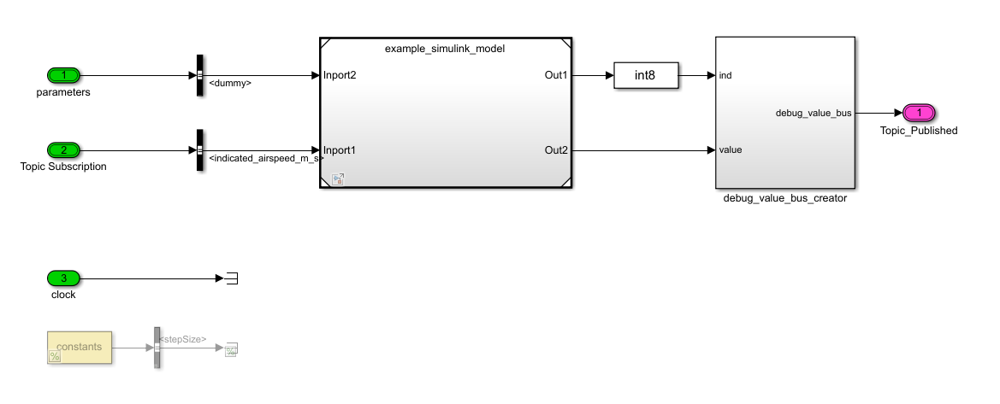

When building up a simulink model from the available templates in `~/PX4_IFR_V3/Tools/simulink_controllers/templates` the necessary structure and content is already present. For other models (e.g. already existing models used in simulation) the parts must be added manually.

>**Important:**
>**When working with the simulink models they should be opened by calling the openModel() function and NOT directly!**

This automatically ensures that all necessary bus definitions for the uORB Messages resp. topics and also the `parameterBus` are added automatically, so the user can work with them in Simulink.  

The openModel() can be called from the command line in MATLAB or by running the `openModel.m` file. Upon calling it searches the folder containing all simulink models (currently: `PX4_IFR_V3/Tools/simulink_controllers/`) and lists all found model folders in a list. The relevant model can be selected by typing in the corresponding number and pressing `Enter`.

#### 2.3.1. Parameters

All simulink model folders must contain a file named `defineParameters.m`. Within this file the user can define parameters, which are used by the model and are transformed into PX4 parameters by the IFR-CodeGen. These parameters offer the possibility to be changed while the autopilot is running, which can be very helpful during operation (e.g. for controller gains tuning). More about PX4 Parameters can be found on the [Parameter][12] page in the PX4 User Guide.

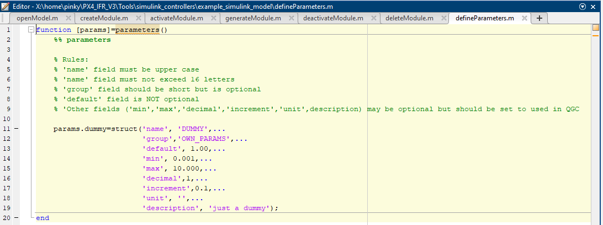

The above picture shows an example parameter definition. At the beginning of the `defineParameters.m` file you find the rules, which apply to certain fields when defining a new parameter:

  1. The `name` field must be upper case.
  2. The `name` field must not exceed 16 letters.
  3. The `default` field must be filled. It contains the default value for the parameter.

All other fields (`group`, `min`, `max`, `decimal`, `increment`, `unit` and `description`) are optional. They may be removed or not be present in a parameter definition. However, it is advisable to fill out and include all fields. They will show up in ground control station software (e.g. QGC) and are very helpful for the user by providing additional information like a description.

The `group` field offers the possibility to collect several parameters in one group. By doing so they can be easily selected from the very long list of all PX4 Parameters just by their group name. For example the ground control station software QGC offers this possibility. It usually makes sense to at least group all parameters of one model. Depending on the number of model parameters using several different groups may be useful. The group name can even be used by parameters from different models resp. modules which offers even more ways for organizing own parameters.

In the Simulink model itself a single parameter can be selected from `parameterBus` with a Bus Selector Block. 

  > Newly defined parameters can only be accessed in the model after reopening the model with the openModel() function.

Currently two limitations regarding model resp. PX4 module parameters exist when using the IFR-CodeGen:

  - All parameters defined in the `defineParameters.m` file are of type `single`. The PX4 Firmware itself also offers the possibility to define parameters either of type `single` or of type `uint32`. The latter is not possible with the IFR-CodeGen.
  - Within a certain model it is not possible to access parameters of other models or existing PX4 modules. The model can only work with its own parameters. When writing a PX4 module directly in C/C++ code, it is possible to access parameters of other modules.

#### 2.3.2. Constants

Momentarily the functionality to define "Constants" is **NOT** implemented. The examples in the template folder contain a dummy file `defineConstants.m`. The content of `defineConstants.m` is ignored at the moment and not required for the IFR-CodeGen V3. Also the "constant" blocks in the example simulink models are commented out (see picture with model above).

The feature to define constants may be implemented in future version of the IFR-CodeGen.

#### 2.3.3. Clock

Every simulink model must contain an inport named `clock` of data type `single`. This can also be seen in the picture with the example model above. 

The `clock` value is the number of seconds which have passed since the module has been started. It is used to schedule the execution of the module's code and can be accessed by the simulink module for internal usage.

#### 2.3.4. Subscribe to Topics

The uORb messaging is used for inter-thread/inter-process/inter-module communication within the PX4 Firmware. It is structured into several "topics". Every module can subscribe resp. read the content of several topics and publish resp. write or modify the content of several topics. With the mechanism modules can access required information generated by other modules and provide information for other modules. More details can be on the PX4 User Guide page about [uORB][13].

Upon opening the Simulink Model with the openModel() function a bus definition is created from all defined topics in the `/PX4_IFR_V3/msg` folder. The topics can be accessed with inports which have the topic's related bus definition as the selected data type (see picture with the example for the `airspeed` topic below).

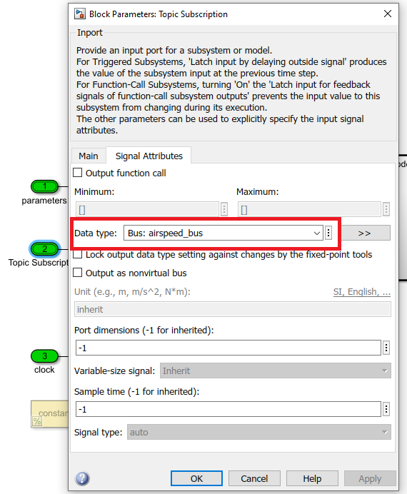

Right after opening the model the bus definitions may be missing from the selection menu for the data types in Simulink. They show up after using `--- Refresh data types ---` from the menu and reopening the menu.

The content or fields of the topics linked to inports can accessed with a standard bus selector block from Simulink.

Momentarily the field "timestamp" can only be accessed for selected topics after opening the Simulink model with the openModel() function. For all other topics this field is missing and cannot accessed with bus selector blocks.

#### 2.3.5. Publish Topics

For some general information about the uORB messaging and Topics see section [2.3.4](#224-subscribe-to-topics) above.

All of the topics which the model should publish must be linked to an outport. This works identically to subscribing to topics by setting the corresponding bus as the data type of the outport. (see section [2.3.4](#224-subscribe-to-topics) above).

Usually every topic consists of a unique selection of fields with different data types and names. Consequently creating the corresponding bus in Simulink must contain all fields with the correct data type. An outport linked with a certain topic will only accept to be connected to the correct corresponding bus. To help in this process the `addPx4BusCreator()` function can be called.

The `addPx4BusCreator()` is called from the Matlab Command Window while the Simulink stays open. It requires the topic name with the `_bus` postfix as the single input argument (see below for an example for the `airspeed` topic). Autocompletion is helpful here, as all topic busses are already in the workspace and recognized.

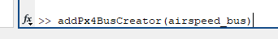

After executing the `addPx4BusCreator(topicname_bus)` function a Simulink block appears in the top left corner of the model. The user probably has to zoom out to see the block. Subsequently it can be placed right before the corresponding outport (see picture below). It is very important that all signals going into the bus creator block have the correct data type for the connected bus variables resp. topic fields.

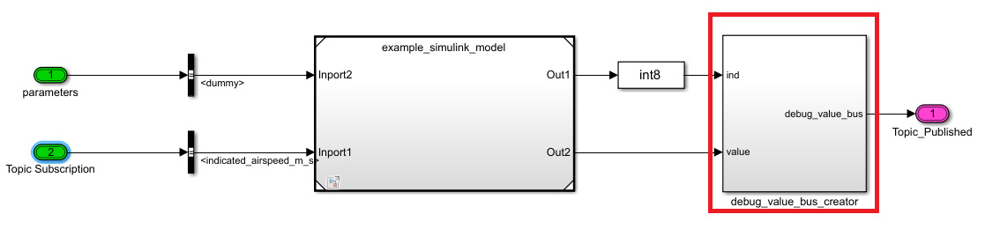

#### 2.3.6. Create own Topics (uORBs)

The IFR-CodeGen offers the possibility to subscribe and publish to all existing topics in the original PX4 Firmware. For various reasons it is often required to publish (and potentially subscribe) to self defined topics when expanding the PX4 Firmware with own modules. Luckily, it is very the easy to extend the set of available topics.

First a new definition file must be added to the `/PX4_IFR_V3/msg` folder. It is a simple text file and must have the `.msg` extension. It can be created or modified with every text editor and IDEs (e.g. *VS Code*). Then, the name of the new topic (including the `.msg` extension) must be added to the `CMakeLists.txt` file also located in the `/PX4_IFR_V3/msg` folder.

The topic definition must contain a `uint64 timestamp` field. It is typically placed as the first variable resp. field. After this the necessary variables resp. fields can be added (see picture below). The usual range of integer and floating point data types is supported. It is advisable to look at already existing topic definitions as an example. 

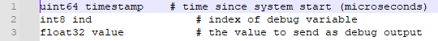

Some rules have to be followed when creating new topic definitions:

  1. Topic definition file names with `.msg` extension are lower case.
  2. Topic definition files with `.msg` extension are not allowed to have a trailing underscore `NOT allowed: example_.msg`
  3. Within the topic definition the variable resp. field names must be lower case and NOT contain any upper case characters.

Within the existing topic definitions there are also examples for additional features that can be included (e.g. variables with a value, or bitmasks). These features are currently not supported in the IFR-CodeGen V3.

#### 2.3.7. Check Model

After modifying and simulink model and before closing it, it is advisable to compile the model and check for static errors. This can be done by clicking `Update Model` from the `Debug` Tab.

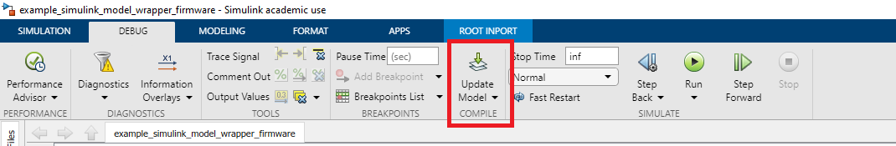

While the code generation will work without this step, it is a good possibility to catch potential errors as early as possible. Otherwise these errors may occur at a later step (e.g. during final compilation of the PX4 Firmware) requiring to start over again. It also make sense to tackle not only the errors but also all warnings as they may become errors during the later process.

### 2.4. Creating the Module

The next step in the IFR-CodeGen is to create the module in the PX4 Firmware, which will later be filled with the generated code from Simulink model. This can easily be achieved by calling the function `createModule()` resp. run the file `createModule.m`. The file is found on the top level of the `ifr_codegen\` folder. 

The `createModule()` function collects all model subfolders located within `/PX4_IFR_V3/Tools/simulink_controllers/`, where all models must be stored to be used with the IFR-CodeGen (see [2.1.](#21-adding-simulink-models)). All found models are shown in an alphabetical list. The user can select the relevant model by typing in the corresponding number from the list.

This will create a new folder in the modules folder `/PX4_IFR_V3/src/modules/` of the PX4_Firmware. The name of the new folder is also the module name. It is the model name with a prefix specified in the `Prefix.txt` text file. By using a prefix every module created by the IFR-CodeGen can easily be recognized within all the other modules. The prefix can easily be changed to the user preferences by modifying the content of `Prefix.txt`.

  > **Important: The name of the module (including its prefix) is not to be changed after creating the module. If this is necessary, the module should be completely removed and created from scratch.**

Creating the module includes copying some core, skeleton and preference files to the module folder. If the `createModule()` function detects, that a folder resp. module with an identical name already exists, it will ask the user if the content of the old folder should be overwritten. Choosing to overwrite will completely remove the all of the old content.

### 2.5. Activating the Module

Creating the module in the previous step is only adding a new module to the source code of the PX4 Firmware. It does **NOT** automatically append the new module to the list of modules which are included when the binary of a certain flight control board is compiled. Every board has one or even multiple build targets (e.g. `default` and `debug`). By invoking the name of the required build target the correct binary of the PX4 Firmware is compiled for a certain flight control board.

Even if included in the Firmware of a certain flight control board, the module is not automatically started when the board is booted up. Still, it is part of the Firmware and may be started manually by the user. If it should be started during the boot process, the module must be added to the list of modules which are automatically started. This list is not linked to a certain flight control board but to a "vehicle type". The PX4 Firmware supports various vehicle types with the most important ones being fixed wing drones and multi-copters (others are rovers resp. UGVs, VTOLs, Airships and UUVs).

Both of the above steps are covered when this guide is speaking of "Activating the module". Only after adding the new module to a flight control board and starting it automatically, the functionalities of the original Simulink model are permanently available when operating the user's UAV or other vehicle. While both steps can be achieved by manually modifying the source code of the PX4 Firmware the IFR-CodeGen offers a more user-friendly option. For this the function `activateModule()` must be called resp. the file `activateModule.m` must be run, which is also located at the top level of the folder `ifr_codegen\`.

The `activateModule()` function searches the `/PX4_IFR_V3/src/modules/` folder for existing modules, which have been created with the IFR-CodeGen. They are listed automatically and the user can select one by typing in the corresponding number.

#### 2.5.1. Adding a Module to a Board

After selecting an existing module after calling the `activateModule()` function, the user is asked if the module should be added to a (flight control) board. Denying it, skips the rest of this step and immediately continues with the Auto-Start Setup (see the following section). If the user states `yes`, a follow-up question pops up, asking if a "standard board selection" should be used.

Denying the last question concerning standard boards" the user is presented a list which shows all possible boards the PX4 Firmware can be compiled for. The list is relatively long containing almost 60 boards for PX4 v1.13.2. This makes finding and selecting the relevant board a cumbersome process. To help with that the "standard board selection" comes into play. If the user states `yes` when asked to use the "standard boards" the list is reduced to a limited set of boards, which are the most relevant ones for the user. This list can easily be modified by the user by altering the content of the `Standard_Boards.txt` text file found in the top level of the `ifr_codegen\` folder. The boards specified in the `Standard_Boards.txt` text file must also be present as boards in the PX4 Firmware otherwise they will not show up (be aware of spelling mistakes!). Currently the default boards selected in `Standard_Boards.txt` are `cubepilot\cubeorange`, `px4\fmu-v5` and `px4\fmu-v6x`. This selection covers the popular *Pixhawk 4* and *Pixhawk 6* series as well as the popular *Cube Orange*.

  > **Important: The current Beta Version of the IFR-CodeGen only allows to select the "default" variants of the boards. Other variants (e.g. "debug") are completely ignored when calling the activateModule() function.**

Independently from using "standard boards" or not, the user has to know which board to select. This can be checked for the used hardware in the [flight controllers][14] section of the PX4 User Guide.

An alternative to using the `activateModule()` function of the IFR-CodeGen is to enter the build command for a specific with an `boardconfig` option in the WSL shell. For this to work the user has to navigate to the folder containing the PX4 Firmware `~/PX4_IFR_V3/`. An example input may be:

  > make cubepilot_cubeorange boardconfig

This will open a BIOS like menu (see picture below). After selecting `modules --->` the user can interactively add and remove modules from a list. The selected modules will be included when the PX4 Firmware for the board is compiled.

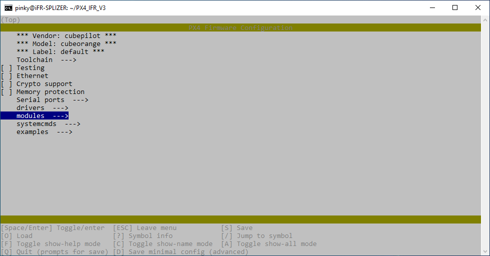

Both methods for adding modules will modify the board configuration files. They can be identified by the `.px4board` file extension and can be found in the `~/PX4_IFR_V3/boards` folder. These files can also be modified manually with any text editor or IDE.

If a module has already been added to a specific board the `activateModule()` function will print an info message in the MATLAB command window, when the user tries to add it again.

#### 2.5.2. Automatically Start a Module

After the user has decided if or if not the module should be added to board, the `activateModule()` function will ask if the module should automatically start. Selecting `No` will end the function immediately. Selecting `yes` gives a list of all possible vehicle types. The user can select one or choose that the module is started automatically for every vehicle type. Typical vehicle types for UAVs are `Fixed-Wing`, `Multi-Copters` and potentially `VTOL`.

Automatically starting a module is basically independent from adding a module to a board. However, it does not make sense to auto-start a module which is not included for a certain board.

The configuration files for starting modules in the PX4 Firmware can be found in the folder `~\PX4_IFR_V3\ROMFS\px4fmu_common\init.d\`. For every vehicle type a separate file exists, which can be identified by `_apps` in its name, which is actually the last part of the file extension. An example would be `rc.fw_apps` for fixed-wing vehicles. The `activateModule()` function will alter these files, but the could also be manually modified with any text editor or IDE.

If a module is already in the auto-start list for a specific vehicle type, the `activateModule()` function will print an info message in the MATLAB command window, when the user tries to add it again.

### 2.6. Generating the Code

The generation of the code for the module containing all the functionalities of the original Simulink model is the core concept of the IFR-CodeGen. It uses Simulink internal capability (when the correct toolboxes are installed) to generate C-code of the model. In the next step the generated code is put into a framework which fits the requirements of a PX4 module. 

Starting this complex process actually requires little user input and is completely automatic. The process is started by running the MATLAB script `generateModule.m` found in the top level of the `ifr_codegen\` folder. The script searches the `/PX4_IFR_V3/src/modules/` folder for existing modules, which have been created with the IFR-CodeGen and identifies the corresponding Simulink model. In order to do this the `createModule()` function must have been successfully executed beforehand, which is consequently a requirement. Not a requirement is adding the module to a certain board or adding it to the auto-start list for a vehicle. The activateModule() function may be called before or after the script `generateModule.m` is executed.

After the script has been successfully found all module(s), which have been created with the IFR-CodeGen, it asks the user to select one. Then, the user can change the `stacksize` of the module. The modules generated by the IFR-CodeGen run as separate tasks which all have an individually allocated memory stack. The default value for the stacksize is `2048 Bytes`. While this is typically enough for most simple or basic GNC functionalities, it may be extended for more complex modules with higher memory demands. 

The actual used stack of a running module in the PX4 Firmware can be checked with the help of QGroundControl by accessing the Mavlink Shell and running the `top` command. The developers have introduced the possibility to run modules as *work queue tasks* in newer version of the PX4 Firmware. Such modules share their memory with other modules on the same task. Momentarily the IFR-CodeGen does not support this and relies on the traditional *tasks* with its own stack. More Infos about this can be found in the [PX4 Architectural Overview][15] section of the PX4 User Guide.

Currently the actual code generation of a module takes place in a working folder. This is located on the C: drive `C:/PX4_Firmware_IFR_CodeGen/`. This is required because of performance reasons when running Simulink within the WSL and may be changed in future versions of the IFR-CodeGen.

### 2.7. Building the Firmware

Compiling the PX4 Firmware with or without modules added by the IFr-CodeGen does not differ. The build can be initiated be executing a `make` command within the WSL shell. For this the user has to navigate to the folder containing the PX4 Firmware (e.g. `~/PX4_IFR_V3/`). Every flight control board has its own dedicated make commands. The correct build target can be found by studying the corresponding page in the PX4 User Guide [flight controller][14] section. An example for the Cube Orange hardware would be

  > make cubepilot_cubeorange

When all of the previous steps, from creating the module till generating the code have been successfully finished, the module with all the functionalities from the original Simulink model is automatically a part of the build. 

More infos about building the PX4 Firmware can be found in the [ Building PX4 Software][16] section of the PX4 User Guide.

Alternatively, when *VS Code* is installed correctly (including the C/C++ Extension Pack) the build process can also be started directly within the source code editor. The necessary interface can be found in the bottom bar. For this to work the user must select `PX4 detect` as the active kit. Then the user can easily select the build variant (e.g. *px4_fmu-v5*) in the example picture below. The actual build process is started by clicking the *Build* button.

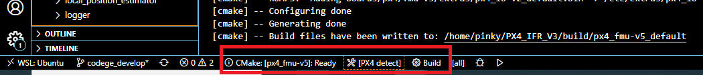

Building directly in *VS Code* is very convenient when manually modifying parts of the PX4 source code with *VS Code*. 

  > **Important: Currently building the PX4 Firmware for the Cube Orange flight controller directly in *VS Code* is not working. To the authors knowledge only the Cube Orange is affected by this bug. The method works flawlessly for other flight control boards.**

### 2.8. Flashing the Firmware

The final step to run any PX4 Firmware on a vehicle's autopilot hardware is to flash it to the flight controller board. For an existing binary in the WSL the quickest way is to use the QGroundControl software. After opening QGC the following steps are necessary

  1. Make sure the flight control board is disconnected from the computer.
  2. Select *Firmware* from the left side of the *Vehicle Setup* menu. 
  3. Connect the flight control board to the computer via USB cable when prompted.
  4. Go to the *Firmware Setup* on the right side of the window. Choose *PX4 Pro* as the flight stack and check the *Advanced Settings* box. Then, from the drop-down menu select *Custom firmware file* and click *Ok* in the top right corner.
  5. Select the binary from the WSL network drive. It is located in the `~/PX4_IFR_V3/build/__boardname__/` folder and also named like the used *\_\_boardname__* with the `.px4` file extension. Tip: pin the folder to *Quick Access* in the windows explorer.
  6. Wait for the flashing process to be finished. The autopilot will automatically restart. Afterwards the user can directly interact using QGC.

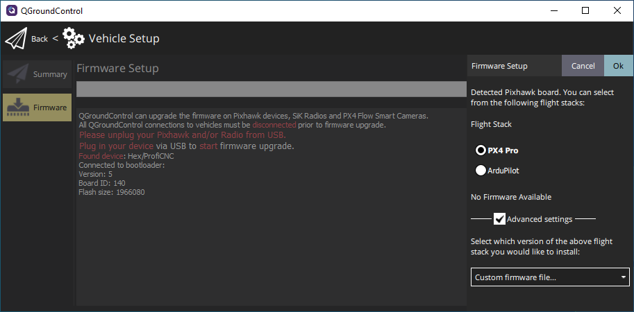

### 2.9. Deactivating a Module

Depending on the situation the user may want to:

  - Remove a module from a flight control board's list of included modules. This will keep the module as an integral part of the PX4 Firmware but it is not part of the build for a certain board. 
  - Remove an existing module from the auto-start list of a certain vehicle type. The module will still be compiled when added to a board, but will not start automatically.

Both actions can be interactively performed by calling the function `deactivateModule()` resp. run the file `deactivateModule.m`. Like in its counterpart, the `activateModule()` function, the user is guided through the process with questions and can decide by choosing the appropriate answer in the MATLAB command window.

After the `deactivateModule()` function has detected all present modules, which have been created with the IFR-CodeGen, the user can select the relevant one. 

#### 2.9.1. Removing a Module from a Board

At first the `deactivateModule()` function will ask, if the module should be removed from a flight control board. Denying it, skips the rest of this step and immediately continues with the possibility to remove the module from the Auto-Start (see the following section). If the user states `yes`, a follow-up question pops up, asking if a "standard board selection" should be used or not. Both options will produce a list of boards from which the user can select one. Alternatively, it is also possible to remove the module from all boards.

If the `deactivateModule()` function successfully removes the module from a board, the user will get a confirmation line in the MATLAB command window. There will also be a notification, if the module has not been in the compile-list for a single selected board.

*Hint: more infos about "standard boards" can be found in the [Activating a Module](#25-activating-the-module) section.*

#### 2.9.2. Removing a Module from the Auto-Start

After the step "Removing a Module from a Board" has been completed, the user will be asked, if the module should be removed from the Auto-Start.  If the user states `yes`, the relevant vehicle type can be selected by typing in the corresponding number. It is also possible to remove the module from all vehicle by typing in the number zero `"0"`.

In the MATLAB Command window the result of the ordered action is presented as a short info message. 

### 2.10. Delete a Module

If necessary, the user can completely remove a module from the PX4 Firmware by calling the function `deleteModule()` resp. run the file `deleteModule.m`. After the relevant module has been selected from the list of modules, which have been created with the IFR-CodeGen, the user must confirm that the selected module should be removed completely.

  > **WARNING: Selecting "Yes" will immediately remove the module from PX4 Firmware. This cannot be undone within the IFR-CodeGen.** 

If the user has selected to continue the following actions are performed:

  - Removing the module from all boards.
  - Removing the module from the Auto-Start of all vehicles.
  - Removing the module folder in `~/PX4_IFR_V3/src/modules`.

The results of the deletion process are shown in the MATLAB command window.

The function `deleteModule()` will **NOT** remove the corresponding Simulink model from the `~/PX4_IFR_V3/Tools/simulink_controllers/` folder. Also, the topics, which have been specifically created for the module, will **NOT** be removed from the PX4 Firmware. This must be done manually by the user.

### 2.11. Additional Points

This section covers some additional points, which are of relevance when using the IFR-CodeGen. It is strongly recommended to go through all of these points for first time users. 

#### 2.11.1. Priority and Scheduling within PX4 Firmware

As already explained in the [Generating the Code](#26-generating-the-code) section, the modules created by the IFR-CodeGen will run as traditional *tasks* within the *NuttX* real time operating system. The scheduling of *NuttX* tries to ensure that all tasks have the necessary computational resources to execute their threads with the desired sampling interval. All modules resp. tasks will be given a standard priority by the IFR-CodeGen. 

If the module has a very high computational demand, it is possible that it is not granted enough computational resources because tasks with system critical functionalities (e.g. navigation) will be prioritized. In these cases the behavior of the module may not be as expected and the desired sampling interval may not be possible to be kept.

#### 2.11.2. Coding Style

The standard options for the PX4 compiler are very picky. For example all warnings are treated as errors `-Werror`. This may cause situations where the Simulink Code Generation will generate C-Code without any warnings, but the building of the PX4 Firmware will fail. A typically example are implicit data type conversions, which are not tolerated by the PX4 compiler.

It is recommended to think of this possibility at the early stage of creating or modifying the Simulink models. It is usually preferable to use Matlab Function Blocks with own code rather than combining multiple (basic) Simulink blocks, if this is possible. In these cases, errors in the build process can usually be prevented, if the user takes the following advice:

  > **Write M-Code like C-Code!**

This includes, but is not limited to, consistently declaring and initializing all variables even though MATLAB itself is very relaxed about this.

#### 2.11.3. Free up Stacksize

Depending on the flight control board the flash memory may have very little free space left for additional modules. For example the picture below shows that the Cube Orange standard build for PX4 v.1.13.2 already uses 99,27% of the available flash memory. 

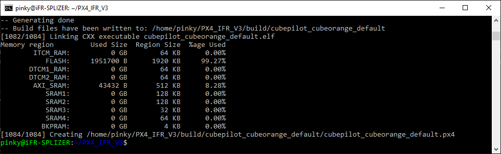

This may be problematic, if a single "big" module or several custom modules are to be added via the IFR-CodeGen. It is possible to free up some of the used flash memory by removing unused resp. unnecessary modules from the flight control board. This task is not an integral part of the IFR-CodeGen, but can be achieved quite simply using the `make <boardname> boardconfig` command. This will open a BIOS like menu where the unneeded modules can easily be deselected. An picture of the menu and some more details can be found in the [Adding a Module to a Board](#251-adding-a-module-to-a-board) section. Alternatively, it is also possible to manually remove the modules by modifying the board configuration files in the `PX4_IFR_V3/boards/` folder. 

No general recommendation can be given, which modules can or should be removed while still keeping all the necessary functionalities of the autopilot. This strongly depends on the intended use case. Eventually the user must decide this. A possible starting point is to remove modules tailored for a special vehicle type, which is not the use case. For example users with a fixed-wing UAV may opt to remove multi-copter modules. Another alternative may be to remove unnecessary drivers.

  > **IMPORTANT: Be aware, that removing a module may have unforeseen consequences. It is recommended to remove modules one by one after. Testing that everything needed is still working as expected in between. Sometime removing a certain module is impossible because it is required by another module. Then building the PX4 firmware will fail. Freeing up enough flash memory may be tedious task.**

#### 2.11.4. Relevant Changes to previous Versions of IFR-CodeGen

This section is for users, which have been working with previous versions of the IFR_CodeGen. It will point out some major differences.

  - When importing a simulink model, which has been successfully been converted to a PX4 module by a previous version of IFR-CodeGen, it may be necessary to recheck the data types of all topic subscriptions and publications. In this version all of the bus data types have now a `_bus` postfix. This change was necessary to enable code generation in newer versions of PX4 Firmware.

  - In previous version the prefix `IFR_` was automatically added to the parameter names defined in `defineParameters.m`. This has been changed in IFR-CodeGen V3 to allow more meaningful naming of own parameters. If it is required by the user, it can be still added manually by starting every parameter name with "IFR_".

#### 2.11.5 Customizing Logger Topics
The logger_topics can be adjusted using a `logger_topics.txt` file on the sd-card or by changing the `logger_topics` related code in the firmware.

In some cases direct access to the sd-card is limited. Use the mavlink console to update the `logger_topics.txt`. The `generateTopics` script simplifies this process by transforming the `logger-topics.txt` to shell commands. The input and output files can be found in `../common/logger_topics/`. Copy and paste The commands in the mavlink console. It will delete the previous file on the sd-card and write the logger_topics to the disk. This will overwrite the topics defined in `src/modules/logger`.

Another possibility is to define the logger_topics directly in the firmware. Copy the contents of `../common/logger_topics/default_topics.txt` to the according method (e.g. `void LoggedTopics::add_default_topics()`) in `src/modules/logger/logged_topics.cpp`.

### 2.12. Custom Changes in the Codegen

#### 2.12.1. Bug fix for `bus_i`

The postfix is required to publish and receive the correct instance of the topic but the topic structure stays the same for all instances. Therefore the bus without the postfix should be imported.

There was a quick fix in `generateCode_V3.m` which erased the postfix completely:
```matlab
% Quick Fix for actuator_controls_0 instead of required actuator_controls problem
inportDataTypes=erase(inportDataTypes, '_0');
```
This leads to receiving the `actuator_controls` topic instead of the correct instance `actuator_controls_0`.

The bus instance is now handled correctly and only the main topic structure `actuator_controls` is imported. (see [fadbc85a](https://git.ifr.uni-stuttgart.de/atol/ifr_codegen/-/commit/fadbc85a003ad2834118a2b18da2c28a838e3595) and [763810a0](https://git.ifr.uni-stuttgart.de/atol/ifr_codegen/-/commit/763810a03c796c07259ff3f822995dc4c8879945))

#### 2.12.2. Removal of `replaceCodeGenFilesV3`

The code generation calls the helperFunction `replaceCodeGenFilesV3` which renames the following functions (regex patterns):
- `rt_powf_snf(`
- `rt_powf_snf\s*(`
- `rt_atan2f_snf(`

It is not quite clear why this is / was needed. For modules with submodules, the renaming leads to unresolved function names as the functions are shared across multiple files. In a single module (like it was in gnc without the submodule), these functions were placed directly in the `gnc.c` file but are now shared in multiple files (with a submodule).

The removal of the function did not show any errors anymore. That's the reason why the function has been removed entirely. If there are any errors with these functions, the helper function should be readded and extended to rename the function in all corresponding files. (see commit [252a912](https://git.ifr.uni-stuttgart.de/atol/ifr_codegen/-/commit/252a9120f493d24d82ec7370eece8fe08c614e40))

## 3. Trouble-Shooting

#### 3.1. Working with a Simulink model

##### Topic busses are not selectable as data type for in- and outports in the Simulink model  <!-- omit in toc -->

 > Refresh data types. Selectable within the data type selection drop-down menu.

##### Defined parameters are not available in the Simulink Model  <!-- omit in toc -->

 > Reopen the model using the `openModel()` function.

##### Own topic is not available in the Simulink Model  <!-- omit in toc -->

 > Reopen the model using the `openModel()` function.

### 3.2. Generate the Code

##### Matlab Warning: Maximum Identifier Length not sufficient  <!-- omit in toc -->
 > Increase the maximum identifier length. Open the Simulink model `openModel()` and go to model settings. In the *Code Generation* tab go to the *Identifiers* section and increase the value for the *Maximum identifier length*. Save the model with the changed settings and try to regenerate the code.

### 3.3. Building the Firmware

##### Compiler throws an unknown or ambiguous error message  <!-- omit in toc -->

 > Use `make clean` before trying to build the firmware for a certain board.

##### Compiler Error: Implicit conversion of data types  <!-- omit in toc -->
 > Caused by "lax" Simulink settings during code generation. Locate the Simulink or code block causing the error and try to fix it with explicitly declaring all variables and data types. Try using data type conversion blocks.
 > The actual cause (block or code) of the error may be hard to track, as the error message itself may be cryptic. Maybe looking into the generated C-Code files helps.
 >  Hint: The error has occurred in the past, if the data type of constant blocks has not been specifically set.

##### Cannot Compile PX4 Firmware for Cube Orange in *VS Code*  <!-- omit in toc -->
 > Known bug when using *VS-Code*. Build PX4 Firmware from WSL shell with make command `make cubepilot_cubeorange`.

#### 3.4. Using the Firmware

##### Pixhawk freezes or crashes when custom module is started  <!-- omit in toc -->

 > Try to increase the memory stacksize for the module (see [Generating the Code](#26-generating-the-code)).
Check for infinite loops or other pitfalls within the Simulink models code.


[1]: https://www.ifr.uni-stuttgart.de/en/
[2]: https://github.com/PX4/PX4-windows-toolchain
[3]: https://docs.px4.io/main/en/dev_setup/dev_env_windows_wsl.html
[4]: https://learn.microsoft.com/en-us/windows/wsl/about
[5]: https://learn.microsoft.com/en-us/windows/wsl/compare-versions
[6]: https://docs.px4.io/main/en/dev_setup/dev_env_linux_ubuntu.html
[7]: https://github.tik.uni-stuttgart.de/iFR
[8]: https://code.visualstudio.com/
[9]: http://qgroundcontrol.com/
[10]: https://github.com/PX4/PX4-Autopilot
[11]: https://github.tik.uni-stuttgart.de/iFR/PX4_IFR_V3
[12]: https://docs.px4.io/main/en/advanced/parameters_and_configurations.html
[13]: https://docs.px4.io/main/en/middleware/uorb.html
[14]: https://docs.px4.io/main/en/flight_controller/
[15]: https://dev.px4.io/v1.11_noredirect/en/concept/architecture.html#runtime-environment
[16]: https://docs.px4.io/main/en/dev_setup/building_px4.html
[17]: https://docs.px4.io/main/en/